<div align="center">



# ⚡ VIKAS // AI + FULL STACK DEV

<a href="https://readme-typing-svg.demolab.com"></a>


</div>

```text
┌────────────────────────────────────────────────────────────────────┐
│  VIKAS.OS   [ONLINE]   │   MISSION: SHIP EXCELLENCE               │
│  SECTOR     [INDIA]    │   STATUS: BUILDING THE FUTURE            │
└────────────────────────────────────────────────────────────────────┘
```

## `> initialize_profile`

> I’m an **Information Science and Engineering student at Basaveshwar Engineering College** building useful, scalable, and visually distinctive digital products.

- ⚡ Full-stack development: **React.js, Next.js, Node.js, Express, Tailwind CSS, MongoDB**
- 🎨 Product design: **Figma, design systems, bento-grid interfaces, motion-led UX**
- 🧠 Exploring practical AI experiences and developer tools
- 🏆 **1st prize winner — Websprint hackathon**
- 🔭 Currently converting ambitious ideas into polished products

## `> load_arsenal --all`

<div align="center">

</div>

## `> launch_products`

<table>
<tr>
<td width="33%" valign="top">

### ◈ YouTube Notes Generator

**VIDEO → KNOWLEDGE**

Full-stack application that transforms video URLs into structured, useful text notes.

`React` `Node.js` `Express` `MongoDB`

</td>
<td width="33%" valign="top">

### ◈ FinSack OS

**MONEY → CLARITY**

Browser-based financial operating system designed to make money management easier for students.

`Next.js` `Tailwind` `MongoDB`

</td>
<td width="33%" valign="top">

### ◈ ForgeFit

**TRAIN → EVOLVE**

Multi-page frontend experience for a personal workout management platform.

`React` `Tailwind` `Figma`

</td>
</tr>
</table>

> **Interface note:** GitHub sanitizes custom CSS, so Markdown cannot provide true hover effects. These cards use responsive HTML layout, visual hierarchy, and linked assets instead.

## `> query_github --analytics`

<div align="center">
<a href="https://github.com/only-vikas"></a>
<a href="https://github.com/only-vikas"></a>
<br /><br />

<br /><br />

</div>

## `> run_contribution_game`

<div align="center">

### 🟡 PAC-MAN MODE // EAT THE COMMITS


</div>

## `> establish_secure_link`

<div align="center">
<a href="https://github.com/only-vikas"></a>
<a href="https://www.linkedin.com/in/vikaskannur"></a>
<a href="mailto:vkannur504@gmail.com"></a>
<a href="https://vikas-kannur-portfolio.onrender.com/"></a>
</div>

<div align="center">

### `// BUILD BOLDLY. DESIGN THOUGHTFULLY. SHIP CONTINUOUSLY.`


</div>
